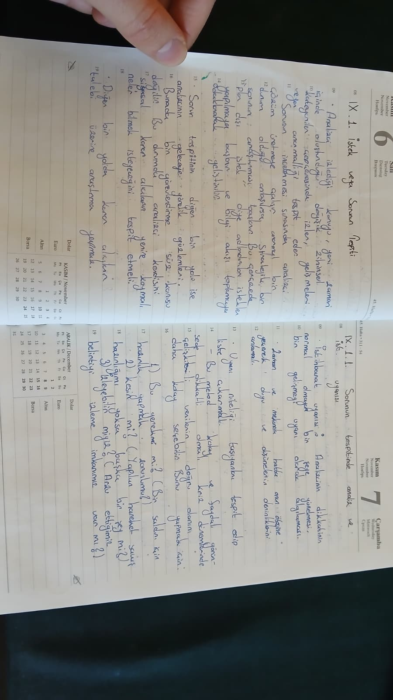

# How do I prepare for the profession of cyber security analyst and CTI?
During my high school years, while being immersed in music, I realized the importance of **knowledge, practice, and analytical skills** alongside learning and applying new concepts. My mathematics teacher showed me special attention and encouraged me to demonstrate my analytical abilities in class.

In my university years, I became aware of the challenges in understanding what was happening in the world. The superficiality of media was an obstacle. Accessing accurate information was not always possible, but it was possible to **synthesize raw data objectively through analysis**. The key was analysis.

Along this path, I began extensive research and reading. The main areas I have studied and applied are:  
- Strategy and scientific research methods  
- Sociological research methodologies  
- Hypothesis formation and analytical techniques  
- Open Source Intelligence (OSINT)  
- Accessing strategic information and the intelligence cycle  
- Report preparation  

I combine all of this with my university field and my strong interest in **cybersecurity**, taking determined steps toward my career goals.

Below, you can find a brief summary of how I am preparing for my profession and the skills I have learned to become an analyst. Being someone who is always open to learning across different fields, you can see that my interests are both interconnected and diverse.

## The following texts are digital versions of my own notes that have been summarized into an academic and clear format with the help of artificial intelligence. The notes were prepared based on information I gathered from lectures and sources.

## Pictures of some of my notes

  
  

